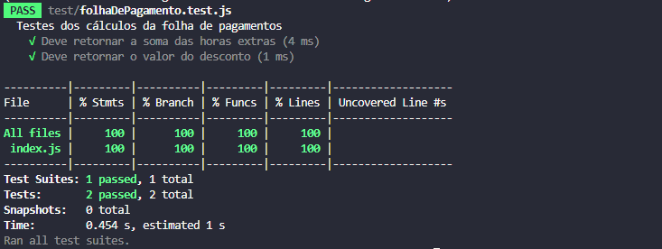
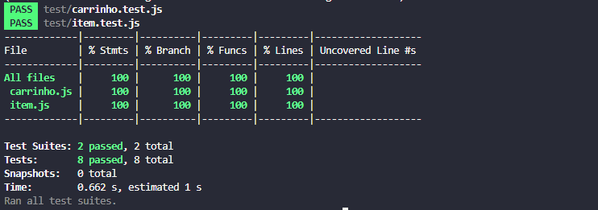
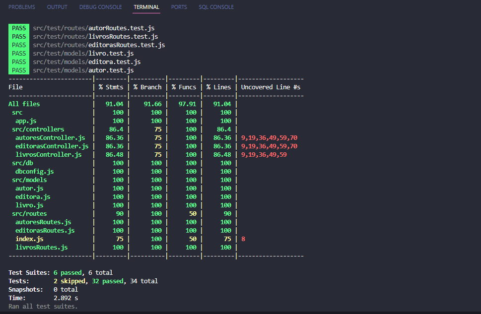

# node-testes

Este repositório serve como um registro do código desenvolvido durante o [Curso de Node.js: testes unitários e de integração](https://cursos.alura.com.br/course/nodejs-testes-unitarios-integracao).

## 📋 Índice
- [🚀 Tecnologias utilizadas](#-Tecnologias-utilizadas)
- [✅ Coverage](#-Coverage)
- [📌 Créditos](#-Créditos)
- [🎓 Certificado](#-Certificado)

## 🚀 Tecnologias utilizadas
Os projetos foram desenvolvidos utilizando as seguintes tecnologias:

- [Node.js](https://nodejs.org/en)
- [Jest](https://jestjs.io/pt-BR/)
- [sqlite](https://www.sqlite.org)
- [sqlite3](https://www.npmjs.com/package/sqlite3)
- [supertest](https://www.npmjs.com/package/supertest)

## ✅ Coverage

✅ primeiro_projeto | ✅ carrinho |
:----------------------:|:----------------------:|
 |  |

✅ livraria | 
:----------------------:|
 |

## 📌 Créditos
  - [Curso de Node.js: testes unitários e de integração](https://cursos.alura.com.br/course/nodejs-testes-unitarios-integracao)

## 🎓 Certificado
  - [Node.js: testes unitários e de integração](https://cursos.alura.com.br/certificate/pablwo/nodejs-testes-unitarios-integracao?lang=pt_BR)
